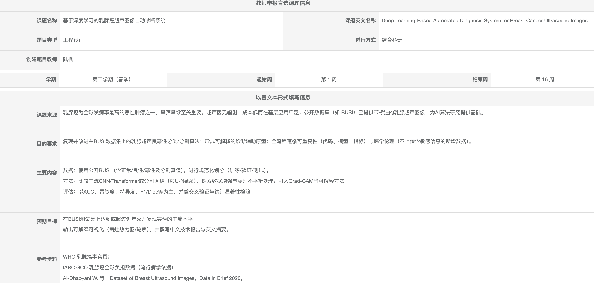

# 基于深度学习的乳腺癌超声图像自动诊断系统

## 📌 任务描述

### 课题基本信息

- **课题名称**：基于深度学习的乳腺癌超声图像自动诊断系统
- **选题类型**：工程设计
- **进行方式**：结合科研
- **开发周期**：第 1 周 - 第 16 周

---

## 🎯 核心任务目标

### 1. 算法复现与改进
- 在公开数据集（BUSI）上实现并优化乳腺癌分类与分割算法
- 达到或超过近年公开文献的主流性能水平

### 2. 原型系统开发
- 形成具有可解释性的诊断辅助原型系统
- 实现病灶区域的自动识别与可视化

### 3. 工程化规范
- 遵循代码可重复性标准
- 严格遵守医学伦理（数据脱敏）

---

## 📊 研究内容

### 数据准备
- **数据集**：BUSI (Breast Ultrasound Images) 公开数据集
- **类别**：正常、良性、恶性三类及分割真值
- **预处理**：数据清洗、规范化划分、类别平衡

### 模型架构
- **分类网络**：CNN (ResNet, EfficientNet) vs Transformer
- **分割网络**：U-Net 系列（Attention U-Net, TransUNet）
- **数据增强**：弹性变换、旋转、缩放、DAGAN

### 可解释性
- Grad-CAM 热力图可视化
- 病灶区域关注度分析

### 评价指标
- **分类**：AUC、灵敏度、特异度、F1-score
- **分割**：Dice 系数、IoU
- **统计**：交叉验证、显著性分析

---

## 📅 阶段规划

### 阶段一：开题 (第 1-4 周)
- [x] 任务描述理解
- [ ] 学习资料收集
- [ ] 任务相关资料收集
- [ ] 开题报告撰写

### 阶段二：中期 (第 5-12 周)
- [ ] 论文复现实验四阶段
  - Phase 1: 无数据增强基线
  - Phase 2: 传统数据增强
  - Phase 3: DAGAN 数据增强
  - Phase 4: 传统 + DAGAN 混合
- [ ] 正式实现代码，完成论文需求
- [ ] 准备中期报告

### 阶段三：答辩 (第 13-16 周)
- [ ] 毕业论文撰写
- [ ] 准备答辩材料

---

## 📚 参考资料

### 核心论文
- Al-Dhabyani W, et al. _Dataset of Breast Ultrasound Images_, Data in Brief 2020.

### 相关标准
- WHO Breast Cancer Fact Sheets
- IARC GCO Global Cancer Burden

---

## 🎓 预期成果

1. **性能达标**：模型在 BUSI 测试集上达到文献主流水平
   - Phase 1: 目标 79% ✅
   - Phase 2: 目标 82% ✅
   - Phase 3: 目标 89% 🔄
   - Phase 4: 目标 93% 🔄

2. **可视化输出**：生成病灶热力图或分割轮廓

3. **文档交付**：完整的技术报告与毕业论文
